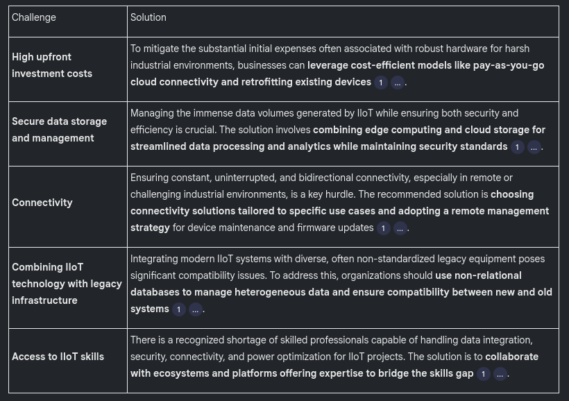

# IIoT and Industrial Automation Briefing Document

## Executive Summary

This briefing document synthesizes key concepts from the provided sources on Industrial Internet of Things (IIoT), industrial communication protocols, cloud and edge computing, AI and Big Data, security, blockchain, and industrial automation. The IIoT is a transformative force, integrating smart devices to optimize industrial operations through real-time data. It is a critical component of Industry 4.0, emphasizing cyber-physical systems and digital transformation. However, this evolution brings significant challenges in security, data management, and integration with legacy systems, necessitating robust solutions and strategic approaches.

## 1. Introduction to IIoT

The Industrial Internet of Things (IIoT) is defined as the integration of "smart sensors, actuators, and connected devices to optimize industrial operations." These systems facilitate "real-time data collection, exchange, and analysis," profoundly impacting sectors like manufacturing, energy, and utilities.

### 1.1 Key Features of IIoT

- **Real-time insights:** Continuous monitoring and analysis of data to improve decision-making.
- **Networked ecosystem:** Seamless device communication for enhanced efficiency.
- **Smart automation:** Leverages intelligent systems to optimize industrial processes, reducing manual intervention.

### 1.2 Benefits of IIoT

The adoption of IIoT offers numerous advantages, including:

- Operational efficiency
- Cost savings
- Sustainability and compliance
- Enhanced decision-making
- Improved safety
- Better product quality
- Competitive advantage
- Remote asset management
- Increased customer satisfaction

### 1.3 IIoT vs. IoT

While IIoT is a part of the broader IoT, it differs significantly in its philosophy, application, and risk profile:

**Purpose and Scope**
User-centric applications across various sectors (e.g., smart home, healthcare)Prioritizes efficiency, safety, and health in mission-critical industrial environments (e.g., oil and gas, manufacturing)

**Impact of Failure**
Minor inconveniencesHigh risks, operational downtime, or life-threatening situations

**Reliability**Consumer-grade, must withstand extreme environments and operate for decades.Requires encrypted and agile system architecture, dedicated chipsets, threat detection, and authentication

**Interoperability & Scalability**Limited to specific devices/protocols, personal useEvolves with open standards to integrate multiple protocols, data sets, and systems; scalable to thousands of sensors and non-IoT devices

**Application Points**Smart home, wearables, smart cities, healthcarePredictive maintenance, industrial automation, transportation, automotive sector

### 1.4 IIoT Architecture

IIoT systems connect intelligent devices to monitor, collect, exchange, and analyze data for process optimization. Key components include:

- **Connected devices:** Sense, communicate, and store information.
- **Data communications infrastructure:** Public and private networks.
- **Analytics and applications:** Generate business intelligence from raw data.
- **Storage:** For generated IIoT device data.
- **People:** Human oversight and interaction.

The core infrastructure consists of:

- **Edge devices:** Sensors and actuators that gather and process data near the source, reducing cloud transmission.
- **Gateways:** Connect edge devices to the cloud, aggregating and transmitting data.
- **Protocols:** Ensure secure, efficient data flow.
- **Cloud processing:** For advanced analytics, storage, and visualization.
- **IIoT platforms:** Central systems for analytics, AI, and visualization.

The **Industrial Internet Consortium’s (IIC) Industrial IoT Reference Architecture (IIRA)** provides a standardized framework for IIoT system development, promoting "interoperability, scalability, and security through a technology-agnostic structure" across Business, Usage, Functional, and Implementation viewpoints.

### 1.5 Digital Transformation and Industry 4.0

Digital transformation is the process of "using digital technologies to transform existing traditional and non-digital business processes and services, or creating new ones, to meet with the evolving market and customer expectations." IIoT is central to this, especially in the transition to **Industry 4.0**, characterized by "integration of IoT, real-time data access, and cyber-physical systems."

**Evolution of Industry:**

- **Industry 1.0 (late 1700s - early 1800s): Mechanization** (water and steam power).
- **Industry 2.0 (early 20th Century): Electrification and mass production** (assembly line).
- **Industry 3.0 (1950s onward): Digitalization** (computers and automation software).
- **Industry 4.0 (Nowadays): Cyber-physical systems** (IIoT, real-time data, AI, interconnectivity).

**Key aspects of digital transformation include:**

- Cloud adoption
- Digital twins (virtual replicas for experimentation)
- Privacy
- Organizational culture (overcoming resistance to change)
- Augmented intelligence (human expertise + AI)
- Digital product management

### 1.6 Challenges and Solutions in IIoT Today

Despite the benefits, IIoT faces significant challenges:

### 1.7 Future of IIoT

The future promises further advancements, including:

- **AI and Machine Learning:** Predictive analytics and real-time decision-making.
- **IIoT as a service (IoTaaS):** Increased accessibility, especially for SMEs.
- **Interoperability and standardization:** Seamless communication across devices.
- **Cybersecurity:** Advanced measures to safeguard systems.
- **Edge computing:** Reduced latency for real-time applications.
- **Sustainability:** Optimization of energy use and waste reduction.
- **Data analytics and visualization:** Enhanced insights for informed decision-making.

## 2. Industrial Communication Protocols

Industrial protocols are essential for enabling communication between diverse hardware from different vendors in industrial environments. They "bridge the gap among incompatible protocols" to ensure flexibility and interoperability.

### 2.1 Classical Protocols (Modbus, Profibus, CAN)

These older protocols are still in use, particularly for "interacting with older machines," enabling connectivity without costly machinery replacement.

- **Limitations:** Generally suffer from less security, slower speeds, and smaller data capacity compared to modern alternatives.

**2.1.1 Modbus**

- **Description:** A serial communication protocol (1979) widely adopted for connecting industrial electronic devices. Available for serial lines (RTU, ASCII) and Ethernet (TCP).
- **Pros:** Ease of use, strong scalability, wide applicability.
- **Cons:** "Lower data transmission rate," "lacks encryption and authentication mechanisms."
- **Use Cases:** Industrial automation (PLCs, sensors), intelligent buildings (HVAC, lighting), energy management.

**2.1.2 Profibus**

- **Description:** A field bus protocol (1989), with PROFIBUS DP (1993) being a widely used variant for communication between field sensors and system controllers.
- **Pros:** High speed and real-time communication, reliable, robust, scalable (up to 126 nodes), standardized.
- **Cons:** Complex configuration, limited flexibility compared to Ethernet-based protocols, higher costs, shorter cable lengths.
- **Use Cases:** Oil and gas, chemical plants, water treatment, railway systems, building automation.

**2.1.3 CAN (Controller Area Network)**

- **Description:** An electronic communication bus defined by ISO 11898, primarily used in vehicles and machines for communication between Electronic Control Units (ECUs) without a host computer.
- **Pros:** Simple, low cost, easy access (central diagnostics), extremely robust, efficient (prioritized frames).
- **Cons:** Demand for higher data rates drives transition to newer variants (CAN FD, CAN XL) or Automotive Ethernet, proprietary data can be an issue.
- **Use Cases:** Automotive industry, industrial machinery, medical applications.

### 2.2 Modern Protocols (IO-Link, OPC UA, EtherCAT, Ethernet/IP, Profinet)

These newer protocols offer enhanced functionalities, particularly in speed and security, enabling "smart factories" reliant on sensor data and data-driven control.

- **Advantages:** Higher transmission speeds for real-time operations, built-in security features.

**2.2.1 IO-Link**

- **Description:** A worldwide open standard protocol for bidirectional data exchange between master devices, actuators, and sensors in industrial settings. It is considered "the foundational technology of the Industrial Internet of Things (IIoT)."
- **Pros:** Simple device replacement, increased data availability (process, service, diagnostic), advanced diagnostics, standardization.
- **Cons:** Limited communication distance (max 20 meters), bandwidth limitations for high-speed processes.
- **How it works:** Sensors connect to a configurable master that uses IODD files to communicate and then sends data to PCs, PLCs, or other systems via protocols like MQTT or OPC UA.
- **Use Cases:** Machine tools, assembly lines, intralogistics, pharmaceutical packaging.

**2.2.2 OPC UA (Unified Architecture)**

- **Description:** A platform-independent, service-oriented protocol that integrates all functionalities of OPC Classic, supporting ARM/x86, Windows/non-Windows, and robust security. It offers "extensibility" and "information modeling."
- **Pros:** Security (authentication, encryption), platform independence, standardization, scalability.
- **Cons:** Resource-intensive, steep learning curve, implementation cost, complexity.
- **How it works:** Supports client/server and publish/subscribe (PubSub) models.
- **Use Cases:** Remote IoT sensor data collection, pipeline monitoring, edge and cloud integration for predictive maintenance.

**2.2.3 EtherCAT**

- **Description:** A real-time Industrial Ethernet technology (IEC61158 standard) focused on "short cycle times (≤ 100 µs), low jitter for accurate synchronization (≤ 1 µs) and low hardware costs."
- **Pros:** High-speed data transfer (low latency), synchronous communication for precise timing.
- **Cons:** Complexity in setup, less suitable for non-time-sensitive tasks, higher cost.
- **How it works:** Master sends a data string, and slave devices process data and send it along.
- **Use Cases:** Industrial automation (robotics, motion control), medical equipment, semiconductor manufacturing.

**2.2.4 Trusted Wireless**

- **Description:** A proprietary wireless technology specifically developed for industrial use, suitable for sensor/actuator information and low to medium data volumes over several kilometers.
- **Pros:** High reliability, strong security (encryption, authentication), optimized for medium-long distances, low power consumption, mesh networking, deterministic communication.
- **Cons:** Limited standardization (proprietary to Phoenix Contact), lower data rates compared to Wi-Fi/5G, range limitations compared to some long-range technologies, vendor dependence, scalability concerns for very large networks.
- **Use Cases:** Water/wastewater, process engineering for serial control data and I/O signals.

**2.2.5 EtherNet/IP**

- **Description:** An industrial network protocol using the Common Industrial Protocol (CIP) over standard Ethernet, managed by ODVA, Inc. It defines how data is organized within TCP/IP or UDP/IP packets.
- **Pros:** Certifiable standard, widely implemented with massive vendor support, fast data transmission (up to 1 ms cycle time).
- **Cons:** Difficult device replacement (no standard for it), high processor bandwidth consumption, no generic diagnostics.
- **How it works:** Supports explicit messaging (client/server, TCP/IP) and implicit messaging (time-critical, UDP/IP).
- **Use Cases:** Industrial automation (PLCs, HMIs, sensors), robotics, automotive production, material handling.

**2.2.6 Profinet**

- **Description:** An open Industrial Ethernet solution based on international standards, designed for data exchange between controllers and devices in automation. It uses standard Ethernet, allowing other Ethernet protocols to coexist.
- **Pros:** High-speed communication (real-time data), scalability and flexibility, seamless integration with IIoT and cloud, reduced wiring costs, supports redundancy, future-proof.
- **Cons:** Higher initial cost, complex configuration, susceptible to cybersecurity threats (being Ethernet-based), shorter cable lengths without switches.
- **How it works:** Systems comprise supervisors (device parameters, diagnostics), controllers (PLCs, manage automation programs), and devices (field devices, send/receive data cyclically).
- **Use Cases:** Factory automation (robots, CNC), process automation (pharma, chemicals), transportation, energy and power.

### 2.3 Industrial Gateways

A gateway is "a computer system or device that acts as a translator" between systems using different communication protocols or architectures. An **industrial gateway** is a critical IIoT device that enables data exchange and transmission, supporting multiple protocols, safety management, device monitoring, and troubleshooting.

**2.3.1 Bridging IT and OT Networks** IIoT gateways connect standalone or integrated sensors to transmit data to IT or cloud servers, especially for "legacy equipment that does not have sensors or control devices" or lacks compatible connectivity options.

**2.3.2 IIoT Gateway Architectures:**

- Sensors/devices to PLC/IPC to IIoT gateway to cloud
- Sensor to I/O modules to IoT gateways to cloud
- Sensors in devices to IoT gateway to cloud
- Sensors to IoT gateway to cloud

**2.3.3 Capabilities and Benefits:**

- **Capabilities:** Protocol translation, data management, device management, computation, communication, resource management, security management, quality of service.
- **Benefits:** Better IT/OT integration, reduced labor costs, energy savings.

### 2.4 Fieldbus vs. Ethernet

The shift from Fieldbus to Ethernet in industrial protocols is driven by Ethernet's advantages:

- **Higher speed and bandwidth:** Ethernet (100 Mbps, 1 Gbps+) significantly surpasses Fieldbus (9.6 kbps - 12 Mbps).
- **IT and OT integration:** Better interoperability between operational technology (OT) and information technology (IT).
- **Lower costs and open standards:** Ethernet benefits from commercial hardware and open standards, unlike proprietary Fieldbus.
- **Scalability and flexibility:** Supports much larger networks (thousands of devices).
- **Real-time performance:** Optimized for low-latency, high-reliability industrial applications through protocols like PROFINET and EtherCAT.
- **IIoT and Industry 4.0 convergence:** Enables connectivity with cloud computing, real-time data analytics, and AI.

### 2.5 Protocol Integration

Data transmission alone is insufficient; "If data isn't stored or used, it's useless." Data must be processed to derive value, often using common libraries on industrial PCs or protocol converters (e.g., PLCs).

## 3. Cloud and Edge Computing in IIoT

Cloud, Edge, and Fog computing are "pivotal in handling massive amounts of data generated by connected devices" in IIoT, optimizing real-time decision-making and data storage.

### 3.1 Cloud Computing

- **Description:** Allows users to "store, manage, and process data over the internet using remote servers," offering scalable infrastructure on a pay-per-use basis.
- **Data Processing:** In remote data centers, ideal for "large-scale, complex analytics tasks."
- **Benefits:** Scalability, flexibility, high availability.
- **Use Cases:** Aggregating data from various IoT devices for large-scale analytics, machine learning, and storage.

### 3.2 Edge Computing

- **Description:** Processes data "near the data source (edge of the network)," minimizing latency and reducing bandwidth by handling data locally.
- **Data Processing:** On local devices or near the network edge, ideal for "real-time decision-making and applications that require immediate response."
- **Benefits:** Low latency, autonomy (operates without constant internet), reduced bandwidth.
- **Use Cases:** Autonomous vehicles, industrial automation, healthcare systems requiring immediate action.

### 3.3 Fog Computing

- **Description:** Extends cloud services to the network edge, acting as an "intermediary layer between the cloud and edge devices." Fog nodes (routers, gateways) process data locally before sending it to the cloud.
- **Data Processing:** Intermediate nodes process data locally, "reducing the volume of data sent to the cloud."
- **Benefits:** Decentralized data processing (lower latency than cloud), enhanced security (less sensitive data sent to cloud), optimized network use.
- **Use Cases:** Smart traffic lights, smart grids, industrial monitoring.

### 3.4 Combination of Technologies

A combined approach optimizes IIoT architecture:

- **Edge:** Initial processing (anomaly detection, filtering) for real-time reactions.
- **Fog:** Intermediate processing and aggregation from multiple edge devices, reducing latency and offloading the cloud.
- **Cloud:** Large-scale, long-term data analysis, historical trends, predictive modeling, and strategic decision-making.

**Benefits of combination:** Scalability and flexibility, cost optimization, improved resilience. **Integration strategies:** Hierarchical model with Level 1 (Edge - basic filtering), Level 2 (Fog - correlation, local alarms), and Level 3 (Cloud - business analytics, global optimization).

### 3.5 IIoT Solutions

- **IoT Platforms:** AWS IoT, Microsoft Azure IoT, Google Cloud IoT provide comprehensive services for device connectivity, data processing, and analytics.
- **Integration Platforms:** Cisco Edge Fog Fabric, Intel OpenVINO Toolkit, HPE Edgeline enhance local data processing and cloud integration.
- **Security Solutions:** IoT Security Foundation (IoTSF), Fortinet Security Fabric offer best practices and comprehensive cybersecurity.
- **Data Analytics and Visualization:** Siemens MindSphere, GE Predix provide cloud-based platforms for advanced analytics and remote monitoring.

### 3.6 Use Cases for Combined Technologies

- **Predictive maintenance:** Edge/fog nodes analyze sensor data for early failure signs, sending relevant alerts to the cloud.
- **Factory automation:** Edge devices make real-time decisions, while the cloud optimizes production processes.
- **Energy management:** Edge handles real-time consumption monitoring, and the cloud performs long-term analysis.

## 4. Artificial Intelligence and Big Data in IIoT

IIoT systems generate "unprecedented volumes of real-time data." The integration of AI with IIoT "unlocks deeper value enabling smarter operations, predictive capabilities."

### 4.1 Data Management

Effective data management is crucial in IIoT to ensure "data quality and reliability," enable "real-time decision-making," support "advanced analytics," and facilitate "integration between operational technology (OT) and enterprise systems (IT)."

- **Real-time management components:** Collection, integration, orchestration, analysis.
- **Value:** Operational efficiency, safety and compliance, innovation, workforce enablement.
- **Challenges:** Complexity of integration, data heterogeneity, quality and reliability issues, scalability concerns.

### 4.2 Role of AI in IIoT

AI "analyzes IIoT data far beyond human capacity, identifying patterns, detecting anomalies, and even learning from events." Key applications include:

- **Predictive maintenance:** Detecting patterns indicating wear or potential failure, reducing downtime and costs, extending equipment lifespan, improving safety.
- **Smart manufacturing:** Real-time decision-making, process optimization, reduced manual intervention, adaptive quality control, smarter inventory.
- **Real-time monitoring:** Instant feedback, early fault identification, live alerts, continuous quality improvement.
- **AI-driven decision-making:** Processing vast datasets for strategic and operational insights, supporting demand forecasting.
- **Intelligent automation:** Handling repetitive tasks, supporting autonomous decisions, reducing human error and labor costs, streamlining supply chains.

### 4.3 Challenges of AI in IIoT

- **Data quality and availability:** AI requires high-quality, structured data, which is challenging to obtain from legacy systems.
- **System complexity and integration:** Bridging OT and IT, integrating AI models into existing workflows.
- **Security and data protection:** Protecting sensitive data from cyber threats, unauthorized access, and data tampering.
- **Ethical and social concerns:** Job displacement, loss of human oversight, privacy risks, accountability for AI decisions.

### 4.4 Big Data and AI Synergy

"Big Data fuels AI with information, while AI makes Big Data manageable and actionable."

- **Process:** Data collection -> Storage and processing -> Cleaning and transformation -> Model training -> Real-time analysis -> Decision-making and automation.
- This synergy "accelerates decision-making, improves efficiency, and unlocks new business opportunities."

### 4.5 Cyber-Physical Systems (CPS)

CPS are "integrated systems that combine physical components with computational elements," using sensors to collect data, process it, and act on it with actuators.

- **Architecture:** Physical processes, sensors, communication networks, computational nodes, actuators, control algorithms.
- **Key Features:** Real-time operation, integration, autonomy and adaptability, networking, data-driven decisions.
- **CPS vs. IoT:** IoT focuses on connecting devices to share data, while CPS involves "intelligent control and real-time interaction with the physical world."
- **Applications:** Smart factories (predictive maintenance, quality control), healthcare (implantable devices), energy (smart grids), transportation (autonomous vehicles).

### 4.6 AI Lifecycle in IIoT

1. **Data Acquisition and Preparation:** Collecting, transmitting, cleaning, filtering, and normalizing data from industrial assets.
2. **Model Training & Validation:** Developing and testing AI models in the cloud, selecting algorithms, training with historical data, validating accuracy, and optimizing.
3. **Edge Deployment & Continuous Improvement:** Deploying optimized models to edge devices for real-time inference, monitoring performance, and updating models with new data to ensure adaptive intelligence.

### 4.7 Use Cases and Tools

- **Use Cases:** Bosch (AI-driven analytics for production), Airbus (predictive maintenance), Siemens (AI in smart factories for energy), John Deere (precision agriculture).
- **Tools and Platforms:Big Data:** Apache Kafka, Apache Spark, Hadoop.
- **AI Frameworks:** TensorFlow, PyTorch, ONNX.
- **Edge Deployment:** NVIDIA Jetson, Intel OpenVINO, Azure IoT Edge.
- **IIoT-Specific:** Siemens MindSphere, PTC ThingWorx, GE Predix.

## 5. Security and Blockchain in IIoT

IoT security is a cybersecurity strategy to "protect IoT devices and the vulnerable networks they connect to from cyber attacks." IoT devices often lack built-in security.

### 5.1 IoT Security Challenges and Solutions

- **Challenges:** Weak authentication, lack of encryption, firmware/software vulnerabilities, insecure communications, difficulty in patching.
- **Addressing Requirements:** Integrated solutions providing "visibility, segmentation, and protection throughout the entire network." This involves learning (authenticating, classifying devices), segmenting (policy-driven groups), and protecting (monitoring, inspection, policy enforcement).
- **Key points:** Understanding IoT security requirements specific to the business and conducting risk assessments for all connected devices.

### 5.2 Threats in IIoT

IIoT introduces new cybersecurity challenges beyond traditional IT, integrating legacy systems, safety-critical processes, and real-time operations. "Cyberattacks in IIoT environments are not limited to data theft, they can disrupt entire production lines, endanger human safety, and damage physical assets."

- **Vulnerabilities:** Inadequate device security, weak authentication, insufficient network visibility, overreliance on device trust, delayed patching, neglecting encrypted traffic inspection.
- **IT-OT Networks:** Convergence of IT and OT has eliminated air gaps, exposing legacy OT devices (lacking modern security features) to threats. Recommendation: "Implement strong network controls and monitor both IT and OT environments continuously."
- **Main types of attacks:** DDoS, Man-in-the-Middle, vulnerability exploitation, malware deployment (e.g., Triton), device hacking, data theft.
- **Impact:** Production downtime, safety system compromise (40% accident rate increase during restarts), significant financial losses (Fortune 500 companies: \~$1.5 trillion annually).

### 5.3 Security Strategies

A comprehensive and proactive approach with security integrated into system design and operation is essential.

- **Defense-in-depth architecture:** Layered security controls (network segmentation, endpoint protection, access control, security monitoring).
- **Segmentation of IT-OT:** Proper network design to limit threat spread, including micro-segmentation and protocol-aware monitoring.
- **Access control and identity management:** Role-Based Access Control (RBAC), Privileged Access Management (PAM), Multi-Factor Authentication (MFA).
- **Device-level security and physical protections:** Tamper detection, hardened enclosures, strict physical security protocols.
- **Protocol and communication hardening:** Using protocol gateways, encrypted tunnels (VPNs), and network traffic whitelisting for protocols like Modbus.
- **Social engineering and insider threats:** Awareness training, access audits, behavioral monitoring.
- **Threat detection and incident response:** Behavioral analytics, protocol analysis, threat intelligence integration, incident response plans.
- **Business continuity and disaster recovery:** Backup systems, alternative manual operation procedures, supply chain continuity plans.
- **Emerging challenges:** AI-powered attacks, expanding attack surface (cloud, edge, 5G), tightening regulations.

### 5.4 Blockchain in IIoT

Blockchain is a "decentralized and tamper-resistant ledger technology that enables secure data recording and validation." In Industry 4.0, it offers a "robust infrastructure to ensure the authenticity and traceability of industrial data, contracts, and processes."

- **Why Combine Blockchain and IIoT?** Addresses lack of trust, data manipulation risks, and centralized control in IIoT by providing a decentralized, transparent, and tamper-proof record.
- **Architecture:** Lightweight nodes (IIoT devices), full nodes (servers), smart contracts, key servers, management hubs.
- **Smart Contracts:** Self-executing code on the blockchain that automates business logic, enforces SLAs, and triggers actions based on sensor data.
- **Asset Tracking and Traceability:** Recording product lifecycles, verifying origin/condition, preventing counterfeiting, especially in industries like food, pharma, electronics.
- **Blockchain Platforms for IIoT:Ethereum:** Public, permissionless, strong dev support, but high energy use, slow confirmation, high transaction fees.
- **Hyperledger Fabric:** Permissioned, enterprise-oriented, private channels, high throughput, scalability for supply chain tracking, production coordination.
- **IOTA:** DAG-based (Tangle) for IoT, no fees, scales with users, good for microtransactions and constrained hardware, but still evolving.
- **Multichain, Quorum, Corda:** Permissioned options for high control, privacy, and compliance, ideal for industrial consortia.
- **Technical Challenges:** Scalability (handling high-frequency IIoT data), latency (slow consensus mechanisms), interoperability with legacy systems, resource constraints of IIoT devices, energy consumption.
- **Future Directions:** Development of scalable/energy-efficient frameworks, standardization, interoperability frameworks, AI-blockchain integration, expansion into circular economy, smart cities.

## 6. Automata, Robots, and Industrial Control

**Industrial automation** uses "machines, robots, and control systems to perform tasks traditionally done by humans, enhancing productivity, safety, and quality." It replaces manual work, reduces human error, improves consistency, and enables 24/7 production.

### 6.1 Industrial Automation

- **Technologies:** Robots, CNC/NC machine tools, PLCs, industrial sensors and actuators, data-driven monitoring.
- **Motivation and Benefits:** Increased productivity, reduced costs, improved product quality, enhanced worker safety, optimized resource use.
- **Types:** Fixed, programmable, flexible, integrated automation.
- **Hierarchy:** Supervisor level (process visualization), control level (PLCs, real-time logic), field level (sensors, actuators).
- **Challenges:** High initial investment, need for skilled technicians, limited flexibility for high variability tasks, potential workforce displacement.

### 6.2 PLCs (Programmable Logic Controllers)

PLCs are "electronic device[s] that control the operation of a machine or process and is made of solid-state." They monitor and control industrial automation, perform testing/measuring, and execute process-type functions.

- **Modern PLCs in IIoT:** Connected PLCs "transform traditional industrial automation by enabling real-time data exchange and smarter control," improving visibility, efficiency, and flexibility.
- **Benefits of IIoT-enabled PLCs:** Real-time monitoring, predictive maintenance, improved safety.
- **Challenges:** Legacy systems compatibility, increased cybersecurity risks, skills gap.

### 6.3 Industrial Robots

Industrial robotics automates repetitive and complex tasks with precision and consistency.

- **History:** First industrial robot, Unimate, in 1962.
- **Components:** Controller (brain), sensors (feedback), programming (high-level control).
- **Types:** SCARA, Articulated, Delta, Cartesian, Polar, Cobots (collaborative robots).
- **Applications:** Welding, material handling, machine tending, picking/packing/palletizing, assembly and finishing.
- **Technological Advances:** AI/machine learning, edge computing, IIoT integration.
- **Challenges:** Hidden costs (integration, tooling), maintenance, limited flexibility for new products, uncertainty in tasks with variable shapes.
- **Future:** Smart factories (Industry 4.0), sustainability, accessibility for small businesses (cobots, RaaS).

### 6.4 Control Systems (SCADA, DCS, HMI)

Industrial Control Systems (ICS) are essential for monitoring and automating processes, transitioning to "highly connected, data-driven environments" with IIoT.

- **Types:SCADA (Supervisory Control and Data Acquisition):** "Centralized monitoring and control over geographically dispersed assets." Evolved to networked/cloud-enabled, offering predictive maintenance and improved visibility.
- **DCS (Distributed Control Systems):** Optimized for large-scale, continuous processes, distributing control tasks across redundant controllers for reliability. Modern DCS supports IIoT interoperability.
- **HMI (Human-Machine Interface):** Operator-facing displays for real-time process visualization and control, now offering interactive dashboards and connecting to edge devices for faster response.
- **Integration with IIoT:** Connects sensors, PLCs, SCADA, and DCS to edge gateways and cloud platforms for comprehensive monitoring and optimization.
- **Benefits:** Real-time monitoring, predictive maintenance, remote diagnostics.
- **Challenges:** Compatibility with legacy equipment, maintaining real-time responsiveness, increased attack surface.
- **Cybersecurity in Industrial Control:** Critical due to threats like ransomware. Best practices: network segmentation, industrial firewalls, secure remote access (VPNs), continuous monitoring. Balancing connectivity with security is essential.

### 6.5 Integration of Automation with IIoT

IIoT architectures enable seamless data flow from field devices to cloud-based analytics, transforming raw sensor data into actionable insights.

- **Typical Integration Layers:** Field devices -> PLCs/DCS -> Edge gateways -> Cloud platforms.
- **Use of Edge Computing:** Crucial for bridging local control and cloud, providing low latency responses, local analytics, and enhanced reliability.
- **Data-driven Control and Predictive Maintenance:** IIoT integration transforms automation into data-driven systems, enabling predictive maintenance, process optimization, and condition monitoring.
- **Interoperability and Standards:** Achieved through open protocols (OPC UA, MQTT), data modeling standards, and gateways for legacy equipment.
- **Challenges:** Complexity of connecting diverse systems, managing massive data volumes, balancing real-time control with cloud processing, security risks. Addressing these requires "careful planning, secure architectures, and collaboration between OT and IT teams."

***

# IIoT and Industrial Automation: A Comprehensive Study Guide

## I. Introduction to IIoT

### A. What is IIoT?

- Integration of smart sensors, actuators, and connected devices to optimize industrial operations.
- Enables real-time data collection, exchange, and analysis across industries like manufacturing, energy, and utilities.

### B. Key Features of IIoT

- **Real-time insights:** Continuous data monitoring and analysis for improved decision-making.
- **Networked ecosystem:** Seamless device communication for greater efficiency.
- **Smart automation:** Leverages intelligent systems to optimize industrial processes, reducing manual intervention.

### C. Benefits of IIoT

- Operational efficiency
- Cost savings
- Sustainability and compliance
- Enhanced decision-making

### D. Differences between IoT and IIoT

- **Purpose and Scope:IoT:** Connects devices across various sectors (agriculture, healthcare, consumer products, smart cities); focuses on user-centric applications, convenience, and lifestyle.
- **IIoT:** Connects machines and devices in industrial sectors (oil and gas, utilities, manufacturing); prioritizes efficiency, safety, and health in mission-critical environments.
- **Impact of Failure:IoT:** Failures result in minor inconveniences.
- **IIoT:** Failures can lead to high risks, operational downtime, or life-threatening situations.
- **Reliability of Components:IoT:** Devices must withstand extreme environments and operate for decades.
- **IIoT:** Requires encrypted, agile system architecture, dedicated chipsets, threat detection, and authentication.
- **Interoperability and Scalability:IoT:** Limited to specific devices and protocols, primarily for personal use.
- **IIoT:** Should evolve with open standards to integrate multiple protocols, data sets, and systems; must be scalable to large networks of thousands of sensors and non-IoT devices.
- **Application Points:IoT:** Smart homes, wearables, smart cities, healthcare.
- **IIoT:** Predictive maintenance, industrial automation, transportation and logistics, automotive sector.

## II. IIoT Architecture and Infrastructure

### A. How IIoT Works

- Connects intelligent devices to form systems that monitor, collect, exchange, and analyze data.
- Provides actionable insights to optimize industrial processes and enhance efficiency.
- Key components: Connected devices (sense, communicate, store), public/private data communications infrastructure, analytics/applications (generate business info), data storage, people.

### B. IIoT Infrastructure Key Components

- **Edge devices:** Sensors and actuators gather and process data near the source, reducing cloud transmission.
- **Gateways:** Connect edge devices to the cloud, managing data aggregation and transmission.
- **Protocols:** Ensure secure, efficient, and seamless data flow.
- **Cloud processing:** Advanced analytics, storage, and visualization.
- **IIoT platforms:** Central systems for analytics, AI, and visualization across the network.

### C. Industrial IoT Reference Architecture (IIRA)

- Developed by the Industrial Internet Consortium (IIC) to standardize and guide IIoT system development.
- Goal: Enhance interoperability, improve system efficiency, and unite IT and OT.
- **How it works:** Provides a standardized framework for designing and operating IIoT systems, promoting interoperability, scalability, and security through a technology-agnostic structure.
- **Four Viewpoints:** Business, Usage, Functional, Implementation.
- **Domain-based Architecture:** Divides IIoT systems into Control, Operations, Information, Application, and Business domains.
- **Key Features:** Interoperability (open standards), Lifecycle support (design to evolution), Aligns technical and business objectives.

## III. Digital Transformation and Industry 4.0

### A. Evolution of Industrial Revolutions

- **Industry 1.0 (late 1700s - early 1800s): Mechanization**Features: Transition from manual labor to mechanized processes using water and steam power.
- Impact: Increased efficiency in manufacturing.
- Significance: Laid foundation for modern industry.
- **Industry 2.0 (early 20th Century): Electrification and mass production**Features: Use of electricity, steel infrastructure.
- Innovations: Assembly line for mass production.
- Impact: Enhanced machinery mobility, dramatically improved efficiency.
- **Industry 3.0 (1950s onward): Digitalization**Features: Shift to electronic and digital systems.
- Innovations: Integration of computers and automation software.
- Impact: Automation of processes, initial interconnectivity.
- **Industry 4.0 (Nowadays): Cyber-physical systems**Features: Integration of IoT, real-time data access, cyber-physical systems.
- Innovations: Interconnectivity between physical and digital systems, advanced data analytics, AI.
- Impact: Improved collaboration, enhanced decision-making, increased productivity, optimized processes, scalable growth.

### B. What is Digital Transformation?

- Process of using digital technologies to transform existing traditional and non-digital business processes and services, or creating new ones.
- Aims to meet evolving market and customer expectations, altering how businesses are managed, operated, and how value is delivered.

### C. Benefits of Digital Transformation

- Increased productivity and reduced labor costs.
- Improved customer experience.
- Fosters innovation and competitiveness.
- Flexibility and scalability (especially with cloud transformation).

### D. Key Aspects of Digital Transformation

- **Cloud adoption:** Transitioning to cloud-based services for efficiency, resilience, and revenue.
- **Digital twins:** Virtual replicas of physical entities for experimentation and decision-making.
- **Privacy:** Critical for trust; balancing convenience with robust data protection.
- **Culture:** Overcoming resistance to change through internal support and leadership.
- **Augmented intelligence:** Combines human expertise with AI's data-processing capabilities to enhance decision-making.
- **Digital product management:** Shifting to customer-centric, product-based thinking.

### E. Examples of Digital Transformation

- Healthcare (EHR, telemedicine)
- Hotel/Tourism (online check-in, PMS)
- Insurance (virtual quotes, online claims)
- Property management (accounting, vacancy optimization)
- Retail (e-commerce, loyalty cards)

## IV. IIoT Today: Benefits and Challenges

### A. Main Benefits of IIoT

- Improved efficiency
- Cost reduction
- Enhanced safety
- Data-driven decisions
- Enhanced product quality
- Competitive advantage
- Remote asset management and monitoring
- Customer satisfaction
- Environmental sustainability

### B. Main Challenges and Solutions

- **High upfront investment costs:** Leverage cost-efficient models like pay-as-you-go cloud connectivity and retrofitting existing devices.
- **Secure data storage and management:** Combine edge computing and cloud storage for streamlined, secure processing.
- **Connectivity:** Choose tailored connectivity solutions and adopt remote management strategies.
- **Combining IIoT technology with legacy infrastructure:** Use non-relational databases for heterogeneous data and ensure compatibility.
- **Access to IIoT skills:** Collaborate with ecosystems and platforms offering expertise to bridge the skills gap.

## V. IIoT of Tomorrow: Future Trends

- **AI and Machine Learning:** Predictive analytics, real-time decision-making, streamlined operations.
- **IIoT as a Service (IoTaaS):** Outsourcing IIoT solutions for accessibility, especially for SMEs.
- **Interoperability and Standardization:** Seamless communication across devices from different manufacturers.
- **Cybersecurity:** Advanced measures (encryption, MFA) to safeguard IIoT systems.
- **Edge Computing:** Reduces latency, supports real-time applications like autonomous machinery.
- **Sustainability:** Optimizes energy use, reduces waste.
- **Data Analytics and Visualization:** Enhanced platforms for actionable insights.

## VI. Automatas in IIoT

### A. Introduction

- PLCs and SCADA are key elements for industrial automation.
- Their integration with IIoT enhances performance with smarter automation and greater control.

### B. Programmable Logic Controllers (PLCs)

- Electronic devices that control machine or process operations; solid-state.
- Receive input data, pass operating instructions via outputs; compact, essential for automation.
- **Roles:** Monitor/control industrial automation, testing/measuring, execute process functions.

### C. SCADA (Supervisory Control and Data Acquisition)

- Computer-based system to monitor, collect, and analyze real-time data from industrial processes.
- Components: Sensors, controllers, networks, HMIs, communication equipment.
- Advantages: Enhanced efficiency, cost reduction, improved data accuracy, better decision-making.
- **SCADA and IIoT:** IoT enhances SCADA capabilities (data collection, automation), while SCADA provides reliability and infrastructure to IoT.
- **Challenges:** Strict real-time/reliability requirements, security risks, data integrity.

## VII. IT/OT Convergence

### A. What is IT/OT Convergence?

- Integration of Information Technology (IT) systems with Operational Technology (OT) systems.
- Enables real-time data exchange to enhance efficiency, decision-making, and operational processes.

### B. What is OT?

- Manages and controls physical equipment and processes in industrial environments.
- Focuses on real-time monitoring, feedback, efficiency, safety, and reliability.
- Examples: Machinery, HMI, PLC, monitoring systems, SCADA.

### C. What is IT?

- Uses computers, servers, and software to store, retrieve, and process data.
- Ensures data availability, confidentiality, and integrity.
- Role: Data-centric tasks (analysis, storage, communication), supports decision-making.
- Examples: ERP, CRM, cloud services, storage systems.

### D. Differences between IT and OT

- **Environment:** IT in general computing, OT in industrial operations.
- **Security:** IT prioritizes data confidentiality, OT focuses on process availability and safety.
- **Maintenance:** IT regular updates, OT scheduled updates to avoid disruptions.
- **Connectivity:** IT highly networked, OT traditionally isolated but increasingly connected via IIoT.

### E. How and Why IT and OT are Converging

- Driven by digital transformation and technologies like IIoT and big data.
- Integrates IT's data management with OT's physical operational systems.

### F. Types of Convergence

- **Physical:** Connecting OT devices to IT networks, upgrading legacy equipment.
- **Software:** Integrating OT data with IT systems for real-time processing.
- **Organizational:** Aligning workflows and collaboration between IT and OT departments.

### G. Role of IIoT in Convergence

- IIoT enables OT devices to collect, transmit, and process data in real-time.
- Adds real-time processing to OT devices, allowing proactive actions.
- Edge computing supports convergence by processing data near the source, reducing network traffic and providing immediate insights.

### H. Impact on Security

- Converged systems increase vulnerabilities as OT systems become exposed.
- Older OT systems lack advanced security features.
- OT environments cannot afford downtime, complicating security updates.
- Requires a unified security approach balancing operational continuity with strong security.

### I. Benefits of Convergence

- Enhanced operational efficiency
- Cost reduction (predictive maintenance, automation)
- Improved decision-making
- Regulatory compliance and risk management
- Innovation and competitiveness

## VIII. Industrial Communication Protocols

### A. Introduction

- Protocols historically developed by hardware vendors to solve specific problems and gain competitive advantages.
- Standards arose to bridge incompatible proprietary protocols, enabling interoperability.

### B. Classical Protocols

- **Uses:** Interact with older machines without needing to replace them, maintaining compatibility.
- **Limitations:** Less security, slower speed, smaller data size compared to modern protocols.
- **Examples:** Modbus, Profibus, CAN.

### C. Modbus

- **Description:** Serial communication protocol (1979), open standard, widely used. Client-server model. Versions for serial (RTU, ASCII) and Ethernet (TCP).
- **Pros:** Ease of use, strong scalability, wide applicability.
- **Cons:** Slow speed, insufficient security (lacks encryption/authentication).
- **How it works:** Client sends commands to server, server processes and responds. User defines data points.
- **Use cases:** Industrial automation (PLCs, sensors), intelligent buildings (HVAC, lighting), energy management (meters).

### D. PROFIBUS

- **Description:** Process Field Bus (1989), for field sensors and system controllers. DP variant (Decentralized Periphery) is widely used.
- **Pros:** High speed, real-time communication, reliable/robust, scalable (up to 126 nodes), standardized.
- **Cons:** Complex configuration, limited flexibility, higher costs, shorter cable lengths.
- **How it works:** Master-slave with token ring for multiple masters. Slaves have failsafe timers.
- **Use cases:** Oil & gas, chemical plants, water treatment, railway systems, building automation.

### E. CAN (Controller Area Network)

- **Description:** Electronic communication bus (ISO 11898 standards). Used in vehicles/machines for ECUs to communicate without a host computer.
- **Pros:** Simple, low cost, easy access (central diagnostics), extremely robust (electrical disturbances), efficient (prioritized frames).
- **Cons:** Demand for higher data rates (push to CAN FD, CAN XL, Automotive Ethernet), connected vehicle needs (predictive maintenance, remote updates), open vs. closed data.
- **How it works:** Nodes connected via twisted-pair/optical fiber. Each node has microcontroller. Data broadcasted. Stages: Arbitration, Error detection, Fault confinement.
- **Use cases:** Automotive industry (standard), industrial machinery, medical applications.

### F. Modern Protocols

- **Advantages:** Higher transmission speed (real-time), enhanced security.
- **Uses:** Centralized data acquisition from sensors, enabling "smart factories" where control is data-driven.
- **Examples:** IO-Link, OPC UA, EtherCAT, EtherNet/IP, PROFINET.

### G. IO-Link

- **Description:** Worldwide open standard protocol for bidirectional data exchange between master, actuators, and sensors. Foundational IIoT technology, provides raw sensor values, eliminates analog signal scaling.
- **Pros:** Simple device replacement (configuration saved in master), increased data availability (process, service, diagnostic), advanced diagnostics, standardization.
- **Cons:** Limited distance (max 20m), bandwidth limitations for high-speed processes.
- **How it works:** Sensors and master. Master uses IODD files from sensors, connects to them, and sends data (MQTT, OPC UA) to PC, PLC, etc.
- **Use cases:** Machine tools, assembly lines, intralogistics, pharmaceutical packaging.

### H. OPC UA (Open Platform Communications Unified Architecture)

- **Description:** Platform-independent, service-oriented protocol integrating OPC Classic functionalities. Supports ARM/x86, Windows/non-Windows, security (encryption, authentication), extensibility, information modeling.
- **Pros:** Security (authentication, encryption), platform independence, standardization, scalability.
- **Cons:** Resource intensive, steep learning curve, implementation cost, complexity.
- **How it works:** Supports client/server and publish/subscribe (PubSub) models. PubSub: server publishes data, client subscribes and receives.
- **Use cases:** Remote IoT sensor data collection, pipeline monitoring, edge and cloud integration for analytics.

### I. EtherCAT (Ethernet for Control Automation Technology)

- **Description:** Real-time Industrial Ethernet technology (Beckhoff Automation), IEC standard IEC61158. Focus on short cycle times (≤ 100 µs), low jitter (≤ 1 µs), low hardware costs.
- **Pros:** High-speed data transfer (data passes without delay), low latency, synchronous communication (precise timing). Ideal for real-time control (servo, motion systems).
- **Cons:** Complexity (technical expertise needed), less suitable for non-time-sensitive tasks, higher cost.
- **How it works:** Master transmits data string, frames embedded in standard Ethernet. Slave devices process data and send it along. Eliminates data collisions.
- **Use cases:** Industrial automation (robotics, PLCs, motion control), medical equipment, semiconductor manufacturing.

### J. Trusted Wireless

- **Description:** Proprietary technology for industrial use, wireless forwarding of sensor/actuator info and low-medium data volumes. Covers distances up to several kilometers (clear line of sight).
- **Pros:** High reliability (resists interference), strong security (encryption, authentication), optimized for medium-long distances, low power consumption, mesh networking, deterministic communication.
- **Cons:** Limited standardization (proprietary), lower data rates, range limitations, vendor dependence (Phoenix Contact), scalability concerns.
- **How it works:** Mandatory use of Phoenix Contact products. Master element connects with non-wireless protocol (Modbus, Profinet) to principal system.
- **Use cases:** Transmission of serial control data, analog/digital I/O signals in large systems (water/wastewater, process engineering).

### K. EtherNet/IP

- **Description:** Industrial network protocol using Common Industrial Protocol (CIP) over standard Ethernet. Managed by ODVA. Application layer protocol within TCP/IP packet, defines data organization.
- **Pros:** Certifiable standard (ensures consistency), widely implemented (massive vendor support), fast data transmission (1 ms cycle time possible).
- **Cons:** Difficult device replacement (no standard), high processor bandwidth consumption, no generic diagnostics (custom).
- **How it works:** Supports explicit messaging (client/server, TCP/IP) and implicit messaging (time-critical, UDP/IP). Components: Scanner (maps I/O), Messaging (explicit), Adapter (device features).
- **Use cases:** Industrial automation (PLCs, HMIs, sensors), robotics, automotive production, material handling.

### L. PROFINET

- **Description:** Open Industrial Ethernet solution based on international standards. Exchanges data between controllers and devices. Defines cyclic and acyclic communication (diagnostics, safety, alarms). Uses standard Ethernet.
- **Pros:** High-speed communication (real-time), scalability/flexibility, seamless integration (IIoT, cloud, IT), reduced wiring costs, supports redundancy, future-proof.
- **Cons:** Higher initial cost, complex configuration (networking knowledge), susceptible to cybersecurity threats (Ethernet-based), shorter cable lengths without switches.
- **How it works:** Three components: IO Supervisor (sets parameters, diagnostics), IO Controller (PLC, manages automation, aggregates data), IO Device (field devices, sends/receives data cyclically).
- **Use cases:** Factory automation (robots, conveyors), process automation (pharma, chemicals), transportation/infrastructure, energy/power.

### M. Fieldbus vs. Ethernet

- **Why it is interesting:** Distinction in how protocols work internally; most new protocols are Ethernet, older ones Fieldbus.
- **Advantages of Ethernet:**Higher speed and bandwidth (100 Mbps, 1 Gbps vs. 9.6 kbps - 12 Mbps).
- IT and OT integration.
- Lower costs and open standards (commercial hardware).
- Scalability and flexibility (thousands of devices).
- Real-time performance and determinism (optimized protocols like PROFINET, EtherCAT).
- IIoT and Industry 4.0 convergence (cloud, analytics, AI).

### N. Industrial Gateways

- **What is a gateway?:** Computer system or device that translates between two systems with different communication protocols, data formats, or architectures. Repackages info, provides filtering and security.
- **What is an industrial gateway?:** Important IIoT device for data exchange and transmission between devices. Multiple ports, supports protocols, translates/bridges. Also handles safety, monitoring, troubleshooting.
- **Bridging IT and OT networks:** Connects legacy equipment or standalone sensors to IT/cloud servers.
- **IIoT gateways within IoT architectures:**Sensors/devices to PLC/IPC to IIoT gateway to cloud (common in existing automation, potentially high attack surface).
- Sensor to I/O modules to IoT gateways to cloud (effective for sensor clusters, bypasses PLC/IPC).
- Sensors in devices to IoT gateway to cloud (for devices with onboard sensors that can't connect directly to internet).
- Sensors to IoT gateway to cloud (retrofitting specific sensors, bypasses existing networks).
- **Capabilities:** Protocol translation, data management, device management, computation, communication, resource management, security management, quality of service.
- **Key Benefits:** Better IT/OT integration, reduced labor costs, energy savings.
- **Examples:** Vitesco Technologies (predictive maintenance), Corpacero (remote machine management), Wattics (energy management analytics).

### O. Protocol Integration: Processing the Data

- Protocols transmit data, but data must be processed to be valuable.
- Use common libraries (C++, Python) on industrial PCs.
- Often requires a protocol converter (e.g., a PLC) to receive raw data and forward it using standard protocols.

## IX. Cloud and Edge Computing in IIoT

### A. Introduction: Cloud, Edge, and Fog Computing

- Pivotal in handling massive data from IIoT devices.
- Differ in where and how data is processed, optimizing real-time decision-making and storage.

### B. Cloud Computing

- **Description:** Store, manage, process data over internet using remote servers (pay-per-use).
- **Data Processing:** Remote data centers; ideal for large-scale, complex analytics; scalable for vast amounts of data.
- **Key Benefits:** Scalability, flexibility (global access), high availability (redundant infrastructure).
- **Use Cases:** Aggregate data from various IoT devices for large-scale analytics, machine learning, storage.

### C. Edge Computing

- **Description:** Processes data near the data source (on devices or local platforms). Minimizes latency, reduces bandwidth.
- **Data Processing:** On local devices/network edge; ideal for real-time decision-making, immediate response.
- **Key Benefits:** Low latency, autonomy (operates without constant internet), reduced bandwidth.
- **Use Cases:** Autonomous vehicles, industrial automation, healthcare systems requiring immediate action.

### D. Fog Computing

- **Description:** Extends cloud services to network edge, intermediary layer between cloud and edge. Fog nodes (routers, gateways) process data locally.
- **Data Processing:** Intermediate nodes process data locally before cloud; reduces data volume sent to cloud.
- **Key Benefits:** Decentralized data processing (lower latency than cloud), enhanced security (less sensitive data to cloud), optimized network use.
- **Use Cases:** Smart traffic lights, smart grids, industrial monitoring (speeds up response times).

### E. Combination of Technologies

- **Data Flow in IIoT Architecture:Edge:** Initial processing (anomaly detection, filtering), real-time reactions without external systems.
- **Fog:** Intermediate nodes process/aggregate data from multiple edge devices, reducing latency, offloading cloud, more advanced filtering.
- **Cloud:** Large-scale, long-term data analysis, historical trends, predictive modeling, cross-site integration, strategic decision-making.
- **Benefits of Combining:** Scalability/flexibility, cost optimization (reduces cloud storage/bandwidth), improved resilience (local decision-making during outages).
- **Integration Strategies (Hierarchical Model):**Level 1 (Edge): Basic filtering, monitoring (e.g., vibration detection).
- Level 2 (Fog): Correlate data from multiple devices (e.g., pattern recognition, local alarms).
- Level 3 (Cloud): Centralized storage/processing for business analytics, global optimization (e.g., predictive maintenance).

### F. IIoT Solutions

- **IoT Platforms:** AWS IoT, Microsoft Azure IoT, Google Cloud IoT (device connectivity, data processing, analytics).
- **Integration Solutions:** Cisco Edge Fog Fabric, Intel OpenVINO Toolkit, HPE Edgeline (fog/edge computing, AI inference).
- **Security Solutions:** IoT Security Foundation (best practices), Fortinet Security Fabric (comprehensive cybersecurity).
- **Data Analytics and Visualization:** Siemens MindSphere, GE Predix (cloud-based platforms for advanced analytics).

### G. Use Cases for Combined Technologies

- **Predictive maintenance:** Edge/fog for local anomaly detection, cloud for deeper analysis.
- **Factory automation:** Edge for real-time quality control, cloud for historical data to improve processes.
- **Energy management:** Edge for real-time consumption monitoring, cloud for long-term analysis to predict peaks.

## X. AI and Big Data in IIoT

### A. Introduction

- IIoT generates massive real-time data. AI unlocks deeper value beyond visibility.
- AI analyzes IIoT data to identify patterns, detect anomalies, learn from events, and suggest proactive measures.
- **Key advantages of AI in industry:** Reduced machine failures/downtime, improved throughput/quality, automated data-driven decision-making.
- **Big Data and IoT:** Converging technologies, IoT generates data, Big Data analytics extracts value.

### B. Data Management

- **Why manage data?:** Ensure quality/reliability, enable real-time decision-making, support advanced analytics, facilitate IT/OT integration, maintain compliance/safety.
- **Real-time management:** Core pillar for IIoT.
- Components: Collection (from sensors, machines), Integration (with ERP, cloud), Orchestration (managing data flow), Analysis (actionable insights).
- **Value of data management:** Operational efficiency, safety/compliance, innovation, workforce enablement.
- **Challenges:** Complexity of integration (legacy systems), data heterogeneity (different protocols), quality/reliability issues (poor/unfiltered data), scalability concerns.
- Importance of data collection phase: Data must be normalized, filtered, transformed at source.

### C. AI in IIoT: Role and Applications

- Analyzes real-time data to enhance efficiency, automation, intelligent decision-making.
- **Key applications:Predictive maintenance:** Detect patterns indicating wear/failure. Benefits: reduced downtime, lower costs, extended lifespan, improved safety.
- **Smart manufacturing:** Machines make real-time decisions, adapt to conditions. Applications: process optimization, reduced manual intervention, adaptive quality control, smarter inventory.
- **Real-time monitoring:** Continuously analyzes production data for deviations/anomalies. Advantages: instant feedback, early fault identification, live alerts, continuous quality improvement.
- **AI-driven decision making:** Processes vast datasets for strategic/operational insights. Contributions: aggregates data, identifies trends, recommends optimizations, supports forecasting.
- **Intelligent automation:** Handles repetitive tasks, supports autonomous decisions. Benefits: reduced human error/labor costs, streamlined supply chain, enhanced responsiveness, greater productivity.

### D. Challenges of AI in IIoT

- **Data quality and availability:** AI needs high-quality, structured data, often lacking in industrial environments (legacy equipment, inconsistent sensors, limited connectivity, lack of standardization).
- **System complexity and integration:** Bridging OT/IT, integrating AI models into existing workflows, interpreting algorithms, ensuring interoperability.
- **Security and data protection:** Risks of unauthorized access, data tampering, exposure of confidential info, vulnerabilities in third-party tools.
- **Ethical and social concerns:** Job displacement, loss of human oversight, privacy risks, accountability for AI decisions.

### E. Big Data and AI: Synergy

- Big Data fuels AI with information, while AI makes Big Data manageable and actionable. Accelerates decision-making, improves efficiency, unlocks opportunities.

1. **How they work together (multi-step process):Data collection:** From sensors, machines, apps; structured, semi-structured, unstructured.
2. **Data storage and processing:** Scalable systems (cloud warehouses, data lakes); AI-ready infrastructure.
3. **Data cleaning and transformation:** Pre-processing with ETL pipelines; ensures consistency, quality.
4. **Model training:** AI/ML models learn from historical data to recognize patterns; more data = more accurate.
5. **Real-time analysis:** AI analyzes streaming/batch data for anomalies, predictions.
6. **Decision-making and automation:** Insights support human decisions or trigger automated actions.

### F. Cyber-Physical Systems (CPS)

- **What are CPS?:** Integrated systems combining physical components with computational elements. Sensors collect data, algorithms process, actuators act.
- **CPS Architecture:** Hardware and software. Includes: Physical processes, Sensors, Communication networks, Computational nodes, Actuators, Control algorithms. Forms intelligent loop of perception, computation, action.
- **Key Features:** Real-time operation, integration, autonomy/adaptability, networking, data-driven decisions.
- **CPS vs. IoT:** IoT connects devices for data sharing (monitoring); CPS involves intelligent control and real-time interaction with physical world (e.g., autonomous vehicle vs. smart thermostat).
- **Real-world applications:** Smart factories (predictive maintenance, quality control), healthcare (implantable devices), energy (smart grids), transportation (autonomous vehicles).

### G. AI Lifecycle in IIoT

- **Data acquisition and preparation:** Collect data from industrial assets (sensors, machines). Key: collection, transmission, preparation (cleaning, filtering, labeling, normalizing). Quality affects model performance.
- **Model Training & Validation:** Develop and test AI models in the cloud. Key: algorithm selection, training (learns from historical data), validation/testing (evaluate accuracy), optimization. Defines AI's intelligence.
- **Edge Deployment & Continuous Improvement:** Deploy validated model on edge devices for real-time decisions. Key: deployment to edge (compressed, optimized), real-time inference, monitoring/feedback loop, model updating (retrain with new data). Enables adaptive intelligence.

### H. AI and Big Data in IIoT Use Cases and Tools

- **Use Cases:** Bosch (AI-driven analytics), Airbus (predictive maintenance), Siemens (energy optimization), John Deere (precision agriculture).
- **Tools and Platforms:**Big Data Tools: Apache Kafka (streaming), Apache Spark (processing), Hadoop (storage).
- AI Frameworks: TensorFlow, PyTorch, ONNX.
- Edge Deployment Platforms: NVIDIA Jetson, Intel OpenVINO, Azure IoT Edge.
- IIoT-Specific Platforms: Siemens MindSphere, PTC ThingWorx, GE Predix.

## XI. Security and Blockchain in IIoT

### A. IoT Security

- **What is it?:** Cybersecurity strategy to protect IoT devices and networks from cyber attacks. IoT devices often lack built-in security, transfer unencrypted data.
- **Main security challenges:** Weak authentication/authorization, lack of encryption, firmware/software vulnerabilities, insecure communications, difficulty patching.
- **How to address security requirements:** Integrated solution (visibility, segmentation, protection).
- **Learn:** Authenticate/classify devices, build risk profiles, assign groups.
- **Segment:** Isolate devices into policy-driven groups.
- **Protect:** Monitor, inspect, enforce policies.
- **Additional points:** Understand IoT security requirements (business, industry specific), conduct risk assessment for IoT devices.

### B. Threats in IIoT

- IIoT benefits come with new cybersecurity challenges, unique to industrial networks (legacy systems, safety-critical processes).
- Attacks can disrupt production, endanger safety, damage assets. Manufacturing is a top target for ransomware.
- **Vulnerabilities:** Inadequate device security, weak authentication/authorization, insufficient network visibility, overreliance on device trust (shadow IoT), delayed patching, neglecting encrypted traffic inspection.
- **IT-OT networks:** Convergence eliminates air gaps, creating challenges. Legacy OT lacks modern security. Increased attack surface. Recommendation: strong network controls, continuous IT/OT monitoring.
- **Main types of attacks:** DDoS, Man-in-the-Middle, Vulnerability exploitation, Malware deployment (Triton), Device hacking, Data theft.
- **Impact of attacks:** Production downtime (revenue loss, supply chain disruption), compromised safety systems (increased accidents), high costs of downtime.

### C. Strategies for IIoT Security

- Comprehensive, proactive approach. Integrate security into design/operation. Understand threats, employ layered defenses, balance efficiency/resilience, foster collaboration, train personnel.
- **Defense-in-depth architecture:** Multiple security controls. Network segmentation, endpoint protection, access control, security monitoring, incident response.
- **Segmentation of IT-OT:** Limit threat spread. Micro-segmentation, asset discovery, protocol-aware monitoring.
- **Access control and identity management:** Control system access. RBAC, PAM, MFA, dynamic policies, employee training.
- **Device-level security and physical protections:** Address device vulnerabilities. Secure boot, signed firmware, physical access controls, tamper detection, hardened enclosures.
- **Protocol and communication hardening:** Industrial protocols designed for reliability, not security. Protocol gateways, encrypted tunnels (VPNs), whitelisting.
- **Social engineering and insider threats:** Human factors are risks. Phishing, physical social engineering, third-party vendors. Awareness training, access audits, behavioral monitoring.
- **Threat detection and incident response:** Early detection minimizes damage. Behavioral analytics, protocol analysis, threat intelligence, incident response plans.
- **Business continuity and disaster recovery:** Robust recovery planning. Backup systems, manual operation procedures, supply chain continuity, rapid restoration.
- **Emerging challenges:** AI-powered attacks, expanding attack surface (cloud, edge, 5G), tightening regulations. Organizations must be agile, invest in innovation, foster security culture.

### D. Blockchain

- **What is blockchain?:** Decentralized, tamper-resistant ledger. Immutability, transparency, cryptographic trust. Ensures authenticity/traceability of industrial data.
- **Why Combine Blockchain and IIoT?:** Addresses IIoT challenges (lack of trust, data manipulation, centralized control). Provides decentralized, transparent, tamper-proof record; trustless environment.
- **Architecture of a blockchain-enabled IIoT system:** Lightweight nodes (IIoT devices, sign transactions), Full nodes (validate, store data), Smart contracts (automated interactions), Key servers (cryptographic keys), Management hubs (orchestration, monitoring).
- **Smart contracts:** Self-executing code on blockchain. Automate business logic, enforce SLAs, trigger alerts/payments based on sensor data. Reduces intermediaries, lowers costs.
- **Asset tracking and traceability:** Mature use case. Records product lifecycle, verifies origin/condition, prevents counterfeiting. Real-time IIoT data linked to blockchain records.
- **Blockchain platforms for IIoT:** Differ from public cryptocurrencies (performance, scalability, control). Require secure, real-time data exchange, smart contract support, trust/traceability.
- **Ethereum:** Public, permissionless, smart contracts (EVM). Good for prototyping. Limitations: high energy, slow, transaction fees.
- **Hyperledger Fabric:** Permissioned, enterprise-oriented. Modular architecture, private channels, high throughput. Use cases: supply chain, production coordination.
- **IOTA:** DAG-based (Tangle) for IoT. No miners/fees, scales with users, good for microtransactions. Challenges: maturity, security validation.
- **Multichain, Quorum, Corda:** Permissioned options. Multichain (simple, fast for internal networks). Quorum (enterprise Ethereum, private contracts). Corda (regulated environments, peer-to-peer). Ideal for industrial consortia.
- **Technical challenges:** Scalability (high-frequency IIoT), latency (slow consensus), interoperability (legacy integration), resource constraints (IIoT devices), energy consumption.
- **Future directions:** Scalable/energy-efficient frameworks, standardization, interoperability frameworks, AI integration, use in circular economy, smart cities, automated compliance.

## XII. Automatas, Robots and Industrial Control

### A. Industrial Automation

- **What is it?:** Uses machines, robots, control systems to perform tasks, enhancing productivity, safety, quality. Reduces human error/labor costs, improves consistency, enables 24/7 production, collects data.
- **Technologies:** Robots, CNC/NC machine tools, PLCs, industrial sensors/actuators, data-driven monitoring.
- **Motivation and benefits:** Increases productivity, reduces costs, improves quality, enhances worker safety, optimizes resource use, supports strategic goals.
- **Types:**Fixed automation: High-volume, unchanging production.
- Programmable automation: Reconfigurable for batch production.
- Flexible automation: Computer-controlled for variable products.
- Integrated automation: Networked, software-driven coordination of entire production.
- **Hierarchy:**Supervisor level: Process visualization, overall monitoring (industrial PCs).
- Control level: Real-time automation logic, operations coordination (PLCs).
- Field level: Sensors/actuators interacting with physical process.
- **Advantages:** Reduces operating/maintenance costs, consistent quality/precision, improves safety, faster production.
- **Challenges:** High initial investment, need for skilled technicians, limited automation for high variability, potential workforce displacement.

### B. PLCs in the IIoT Context

- **Modern PLCs:** Connected to IIoT transform automation by enabling real-time data exchange, smarter control.
- **How IIoT enhances PLCs:** Linking creates intelligent factories. Real-time data collection/analysis, remote monitoring, automatic adjustments, seamless communication for optimized workflows.
- **Benefits of IIoT-enabled PLCs:** Real-time monitoring, predictive maintenance, improved safety (remote operation).
- **Challenges:** Legacy systems compatibility, increased cybersecurity risks, skills gap.

### C. Industrial Robots

- **Introduction:** Transforming manufacturing by automating repetitive/complex tasks with precision/consistency. Used for material handling, welding, assembly, inspection.
- **History:** First industrial robot, Unimate (1962), for die-casting/spot welding.
- **Core components:** Controller (brain), Sensors (feedback, precision), Programming (high-level control).
- **Types:** SCARA, Articulated, Delta, Cartesian, Polar, Cobots.
- **Applications:** Welding, material handling, machine tending, picking/packing/palletizing, assembly/finishing.
- **Technological advances:** AI/machine learning, edge computing, IIoT integration.
- **Challenges:** Hidden costs (integration, tooling), maintenance needs, limited flexibility (reprogramming), uncertain environments.
- **Future:** Smart factories (Industry 4.0), sustainability, accessibility for small businesses (cobots, Robotics-as-a-Service).

### D. Industrial Control Systems (ICS)

- **Introduction:** Essential for monitoring/automating industrial processes. Transitioning from isolated to connected, data-driven environments with IIoT.
- **Types of ICS:SCADA:** Centralized monitoring/control over geographically dispersed assets.
- **DCS (Distributed Control System):** Optimized for continuous, complex processes with distributed controllers.
- **HMI:** Operator-facing displays for visualization/control.
- **PLC:** Rugged controllers for local, deterministic machine control.
- **SCADA systems in connected environments:** Evolved to networked/cloud-enabled architectures. Benefits: predictive maintenance, improved operational visibility, historical data logging. Challenges: heightened cybersecurity risks.
- **Key components of SCADA:** RTUs/PLCs (field interface), SCADA Servers (aggregate, store, manage data), HMIs/Clients (graphical interfaces), Communication networks.
- **DCS:** Large-scale, continuous processes (petrochemicals, power generation). Distributed control, redundancy, hierarchical levels, tight integration with safety. Support interoperability with IIoT.
- **Modern HMIs and Edge Interfaces:** Advanced to interactive dashboards. Connect to edge devices for local processing. Role-based access, secure protocols.
- **Control systems integration with IIoT:** Connects sensors, PLCs, SCADA, DCS to edge gateways/cloud. Typical flow: Field Devices → PLC/DCS → Edge Gateway → Cloud Platform.
- **Benefits of integration:** Real-time monitoring, predictive maintenance, remote diagnostics.
- **Challenges:** Compatibility with legacy equipment, maintaining real-time responsiveness, increased attack surface.
- **Cybersecurity in industrial control:** Critical. Threats: ransomware, unauthorized access. Best practices: network segmentation, industrial firewalls, VPNs, continuous monitoring.

### E. Integration of Automation with IIoT

- Transforms raw sensor data into actionable insights, connecting field devices to enterprise systems/cloud platforms.
- **From field devices to the cloud:** Seamless data flow. Layers: Field devices, PLCs/DCS, Edge gateways, Cloud platforms.
- **Use of edge computing:** Bridges local control systems and cloud analytics. Advantages: low latency, local analytics, enhanced reliability. Applications: quality inspections (AI), real-time health monitoring, protocol translation.
- **Data-driven control and predictive maintenance:** IIoT transforms automation. Benefits: predictive maintenance, process optimization, condition monitoring.
- **Interoperability and standards:** Achieved through open protocols (OPC UA, MQTT), data modeling standards, legacy integration (gateways).
- **Challenges:** Complexity (diverse systems/protocols), managing massive data, balancing real-time control with cloud processing, security risks.

## Quiz

Please answer the following questions in 2-3 sentences each.

1. Explain one key difference between the purpose and scope of IoT and IIoT applications.
2. Describe two benefits of implementing IIoT in industrial operations.
3. What is the primary function of an IIoT gateway in an industrial architecture?
4. Briefly outline how Industry 4.0 differs from Industry 3.0 in terms of key features.
5. List two significant limitations of classical industrial communication protocols like Modbus or Profibus.
6. How does edge computing contribute to the efficiency of IIoT systems, particularly regarding data processing?
7. What is the main role of Artificial Intelligence (AI) in enabling predictive maintenance within IIoT environments?
8. Explain why IT/OT convergence is crucial for modern industrial operations.
9. Describe one core technical challenge that limits the widespread adoption of blockchain in IIoT.
10. What are Cobots, and how do they differ from traditional industrial robots in their application?

## Answer Key

1. IoT connects devices across various sectors like smart homes or healthcare, focusing on user convenience and lifestyle. In contrast, IIoT connects machines in industrial sectors such as manufacturing or oil and gas, prioritizing efficiency, safety, and health in mission-critical environments.
2. Two significant benefits of IIoT are improved operational efficiency, through continuous monitoring and data analysis, and substantial cost savings, achieved by optimizing resource utilization and enabling predictive maintenance to prevent costly breakdowns.
3. The primary function of an IIoT gateway is to act as a translator and bridge between different devices and networks, often connecting legacy equipment or edge devices to IT networks or cloud servers. It aggregates, processes, and transmits data, enabling communication between systems that may use different protocols.
4. Industry 3.0 focused on digitalization with computers and automation software, leading to initial steps toward interconnectivity. Industry 4.0, however, integrates cyber-physical systems, IoT, real-time data access, and AI to achieve deeper interconnectivity between physical and digital systems, fostering enhanced decision-making and collaboration.
5. Two significant limitations of classical industrial communication protocols are lower security, as they often lack modern encryption and authentication mechanisms, and slower data transmission speeds, which may not meet the real-time requirements of many modern industrial applications. They also typically carry less data.
6. Edge computing contributes to IIoT efficiency by processing data closer to its source, which significantly minimizes latency and reduces bandwidth usage. This local processing enables real-time decision-making and immediate responses, crucial for applications like autonomous machinery or industrial automation.
7. AI plays a main role in predictive maintenance by analyzing real-time sensor data from machines to detect subtle patterns indicative of wear or potential failure. This allows for early identification of issues, enabling scheduled interventions, reducing unplanned downtime, and extending equipment lifespan.
8. IT/OT convergence is crucial because it integrates the data management capabilities of IT with the physical control systems of OT, enabling real-time data exchange across the entire enterprise. This integration enhances operational efficiency, improves decision-making through comprehensive data insights, and supports advanced automation initiatives for Industry 4.0.
9. One core technical challenge for blockchain adoption in IIoT is scalability. Blockchain systems may struggle to handle the high-frequency, massive volumes of data generated by thousands of IIoT devices in real-time without experiencing significant latency or requiring excessive computational resources.
10. Cobots are collaborative robots designed to work safely alongside humans, often with inherent size and speed limitations, unlike traditional industrial robots that are typically caged off for safety and perform tasks autonomously. Their purpose is to augment human workers, increasing efficiency and safety in shared workspaces.

## Essay Format Questions (No Answers)

1. Discuss the critical differences between IoT and IIoT, focusing on their respective application environments, reliability requirements, and the consequences of system failure. How do these differences influence the design and implementation strategies for each?
2. Analyze the role of IT/OT convergence in the context of Industrial IoT. Explain the motivations behind this convergence, describe its various types (physical, software, organizational), and discuss the benefits and security challenges it introduces for industrial operations.
3. Compare and contrast two classical industrial protocols (e.g., Modbus, Profibus, CAN) with two modern industrial protocols (e.g., IO-Link, OPC UA, EtherCAT, PROFINET, EtherNet/IP). Focus on their advantages, disadvantages, typical use cases, and how the shift from classical to modern protocols impacts industrial automation and IIoT adoption.
4. Evaluate the combined roles of Cloud, Edge, and Fog computing in an IIoT architecture. Describe how data flows through these layers, the specific benefits each layer provides, and how their integration optimizes industrial processes, offering flexibility, cost efficiency, and resilience.
5. Examine the challenges and solutions associated with integrating Artificial Intelligence (AI) and Big Data into Industrial IoT environments. Discuss specific applications of AI (e.g., predictive maintenance, smart manufacturing) and the technical, ethical, and data-related hurdles that organizations must overcome for successful deployment.

## Glossary of Key Terms

- **Actuator:** A device that converts an electrical signal into a physical action, such as opening a valve or moving a robotic arm.
- **AI (Artificial Intelligence):** The simulation of human intelligence processes by machines, especially computer systems, for tasks like learning, reasoning, problem-solving, perception, and language understanding.
- **Augmented Intelligence:** A human-centered approach to AI that combines human expertise with AI's data-processing capabilities to enhance decision-making rather than replace human roles.
- **Automation:** The use of technology to perform tasks with minimal human intervention, improving efficiency, quality, and safety.
- **Big Data:** Extremely large datasets that may be analyzed computationally to reveal patterns, trends, and associations, especially relating to human behavior and interactions.
- **Blockchain:** A decentralized, distributed, and tamper-resistant digital ledger that records transactions across multiple computers, ensuring data immutability, transparency, and cryptographic trust.
- **CAN (Controller Area Network):** An electronic communication bus standard used in vehicles and industrial machines for Electronic Control Units (ECUs) to communicate with each other without a host computer.
- **Cloud Computing:** A model for delivering on-demand computing services—including servers, storage, databases, networking, software, analytics, and intelligence—over the Internet ("the cloud") on a pay-as-you-go basis.
- **Cobots (Collaborative Robots):** Robots designed to work safely and interact directly with human workers in a shared workspace, without the need for physical safety barriers.
- **CPS (Cyber-Physical Systems):** Integrated systems that combine physical components with computational elements, using sensors to collect data, processing it through algorithms, and acting on it using actuators, enabling autonomous decisions and real-time adaptation.
- **Digital Transformation:** The process of adopting digital technology to fundamentally change how an organization operates and delivers value to customers, often involving the redefinition of business processes, culture, and customer experiences.
- **Digital Twin:** A virtual replica or model of a physical object, process, or system that serves as a real-time digital counterpart for monitoring, analysis, simulation, and decision-making.
- **DCS (Distributed Control System):** A control system for a process or plant, in which autonomous controllers are distributed throughout the system, but overseen by a central operator supervisory control. Optimized for continuous, complex processes.
- **Edge Computing:** A distributed computing paradigm that brings computation and data storage closer to the data sources (the "edge" of the network), reducing latency and bandwidth usage.
- **EtherCAT (Ethernet for Control Automation Technology):** A high-performance, real-time Industrial Ethernet technology used for fast and precise communication in automation applications.
- **EtherNet/IP:** An industrial network protocol that adapts the Common Industrial Protocol (CIP) to standard Ethernet, enabling real-time communication for automation and control systems.
- **Fieldbus:** A family of industrial computer networks used for real-time distributed control, connecting instruments in a manufacturing plant to controllers and other field devices.
- **Fog Computing:** An extension of cloud computing that provides an intermediary layer between the cloud and edge devices, processing data at the network edge via "fog nodes" (e.g., routers, gateways) to reduce latency and bandwidth.
- **Gateway (Industrial Gateway):** A device that translates between different communication protocols, data formats, or architectures, enabling data exchange and transmission between diverse industrial devices and networks, often bridging IT and OT.
- **HMI (Human-Machine Interface):** A graphical user interface that provides a control and visualization platform between a human operator and a machine or system in industrial environments.
- **IIoT (Industrial Internet of Things):** The integration of smart sensors, actuators, and connected devices with industrial applications, focusing on optimizing industrial operations, efficiency, safety, and health in mission-critical environments.
- **IIRA (Industrial IoT Reference Architecture):** A comprehensive framework developed by the Industrial Internet Consortium (IIC) to standardize and guide the development of IIoT systems, enhancing interoperability, efficiency, and IT/OT convergence.
- **IO-Link:** A worldwide open standard protocol for bidirectional point-to-point communication between sensors, actuators, and a master device in industrial automation, providing raw sensor values and diagnostic data.
- **IoT (Internet of Things):** A network of physical objects ("things") embedded with sensors, software, and other technologies for the purpose of connecting and exchanging data with other devices and systems over the internet.
- **IT (Information Technology):** The use of computers, storage, networking, and other physical devices, infrastructure, and processes to create, process, store, secure, and exchange all forms of electronic data.
- **IT/OT Convergence:** The integration of Information Technology (IT) systems with Operational Technology (OT) systems to enable real-time data exchange, enhance efficiency, and improve decision-making in industrial environments.
- **Legacy Systems:** Older hardware, software, or networking infrastructure that is still in use but may be outdated, difficult to integrate with modern systems, or lack contemporary security features.
- **Modbus:** A serial communication protocol developed by Modicon in 1979, widely used for transmitting information between electronic devices in industrial automation.
- **OPC UA (Open Platform Communications Unified Architecture):** A platform-independent, service-oriented industrial interoperability standard that enables secure and reliable data exchange across various industrial devices, systems, and applications.
- **OT (Operational Technology):** Hardware and software that detects or causes a change through the direct monitoring and/or control of physical devices, processes, and events in industrial environments (e.g., machinery, PLCs, SCADA).
- **PLC (Programmable Logic Controller):** An industrial digital computer that has been ruggedized and adapted for the control of manufacturing processes or any activity that requires high reliability, ease of programming, and process fault diagnosis.
- **Predictive Maintenance:** A maintenance strategy that uses data analytics and AI algorithms to predict when equipment failure might occur, allowing for proactive maintenance to prevent unplanned downtime.
- **PROFIBUS (Process Field Bus):** A standard for fieldbus communication in automation technology, used to establish communication between field sensors and system controllers in factories.
- **PROFINET:** An open Industrial Ethernet solution based on international standards, designed for high-speed, real-time data exchange between controllers and devices in automation settings.
- **SCADA (Supervisory Control and Data Acquisition):** A computer-based system used to monitor, collect, and analyze real-time data from industrial processes, and to directly control equipment locally or remotely.
- **Sensor:** A device that detects and responds to some type of input from the physical environment (e.g., light, heat, motion, pressure) and converts it into data that can be read by other electronic devices.
- **Smart Automation:** The use of intelligent systems, often leveraging AI and IIoT, to optimize and automate industrial processes, reducing manual intervention and improving decision-making.
- **Smart Contracts:** Self-executing contracts with the terms of the agreement directly written into code, stored and run on a blockchain, which automatically enforce rules or conditions based on predefined events.
- **Trusted Wireless:** A proprietary wireless communication technology developed for industrial use, characterized by high reliability, strong security, and optimized performance over medium-long distances in challenging environments.
